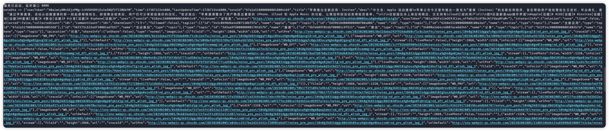
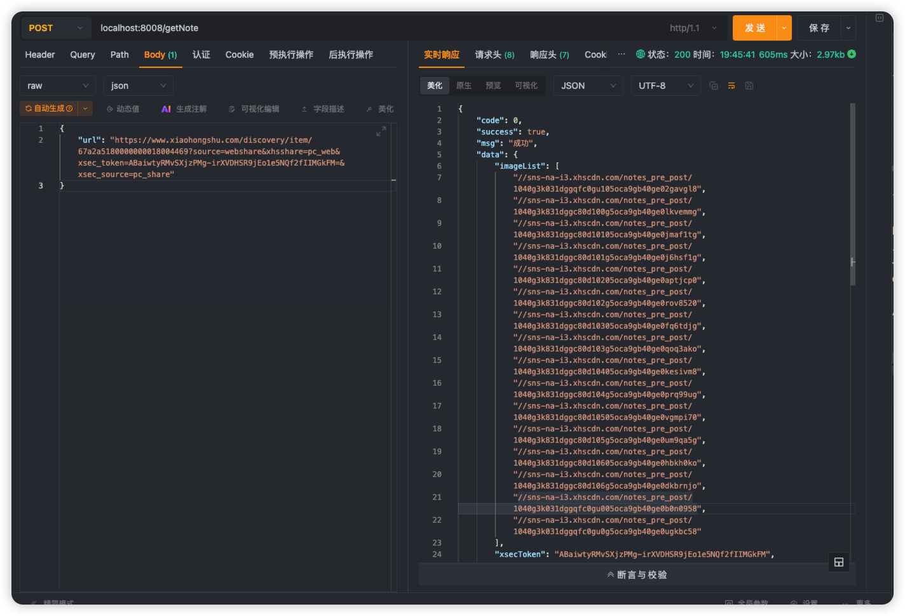

## 某书一件克隆API接口

### 说明
本项目仅用于学习交流，请勿用于商业用途，否则后果自负！！
本项目仅用于学习交流，请勿用于商业用途，否则后果自负！！
本项目仅用于学习交流，请勿用于商业用途，否则后果自负！！

测试基本上图片和原图质量无异，高清无水印，附话题正文
（不要白嫖，请点个🌟）

```shell
# 克隆项目
git clone https://github.com/iCloudZA/XhsNoteClone
# 安装依赖
pnpm install
# 启动项目
node api.js

# 访问 http://localhost:8008
curl --request POST \
  --url http://localhost:8008/getNote \
  --header 'Accept: */*' \
  --header 'Accept-Encoding: gzip, deflate, br' \
  --header 'Connection: keep-alive' \
  --header 'Content-Type: application/json' \
  --header 'User-Agent: PostmanRuntime-ApipostRuntime/1.1.0' \
  --data '{
    "url": "https://www.xiaohongshu.com/discovery/item/67a2a5180000000018004469?source=webshare&xhsshare=pc_web&xsec_token=ABaiwtyRMvSXjzPMg-irXVDHSR9jEo1e5NQf2fIIMGkFM=&xsec_source=pc_share"
}'
```

## 效果



## 声明
本项目仅用于学习交流，请勿用于商业用途，否则后果自负！！